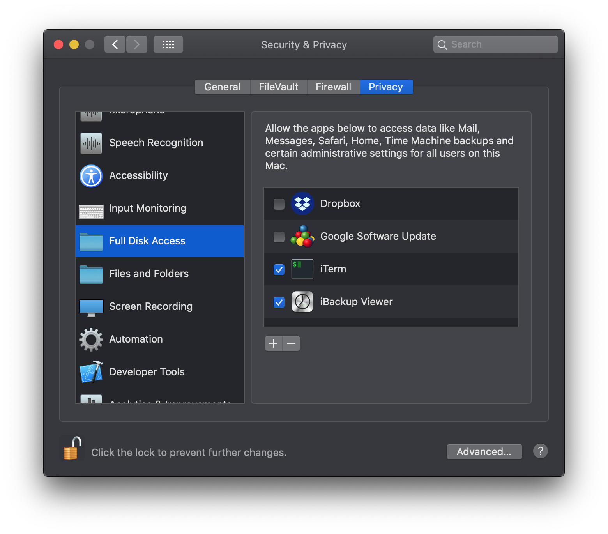

# iDevice Backup Extraction

From http://www.reverendlinux.com/linux/idbe/index.html

With small mods to make it work on my Mac OS Catalina 10.15.4

If you see the following and a flash of `ls: : Operation not permitted` when you run it make sure you are using a terminal that has Full disk access (see screen shot below)

```
iDevice Backup Processor V0.1


Choose which backup to process.
Press Enter to exit.
```

You should see

```
iDevice Backup Processor V0.1


0:  Nov 7 22:47:30 2019

Choose which backup to process.
Press Enter to exit.
```


